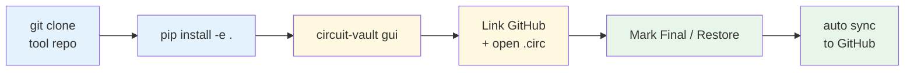
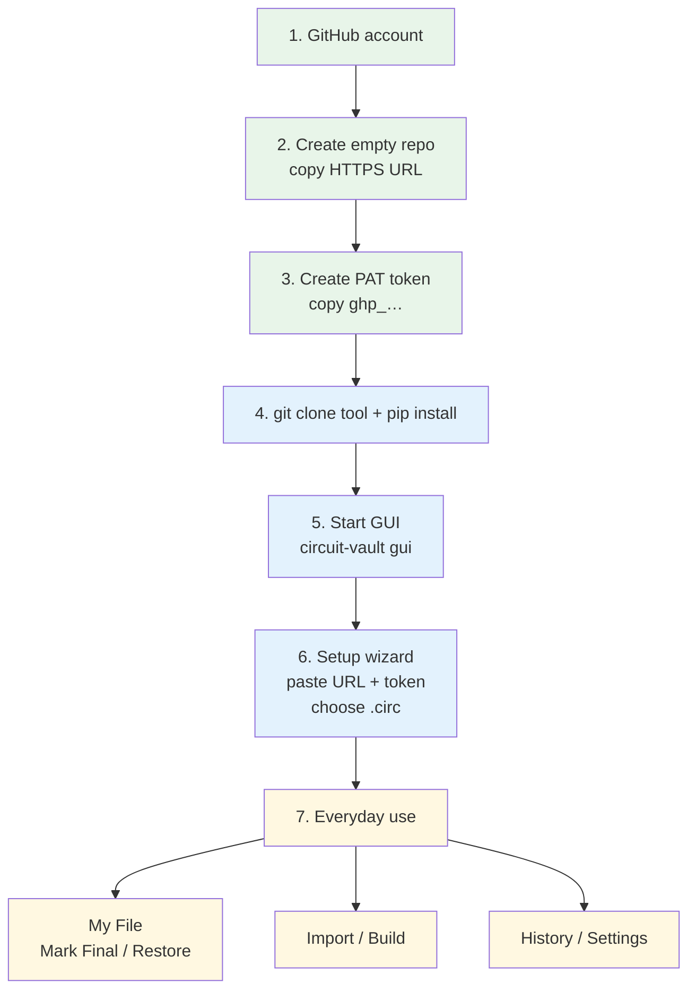

# Circuit Vault

Protect **Logisim** and **Logisim Evolution** `.circ` files on **Windows**, **macOS**, and **Linux**: save per-circuit **finals**, restore one circuit without touching the rest, import shared work, and build from a Claude prompt. GitHub backs up your project folder automatically.

### Quick flow — clone → install → use



| Step | Command / action |
|------|------------------|
| 1 | `git clone …/circuit-vault.git` → `cd circuit-vault` |
| 2 | `python3 -m pip install -e ".[dev]"` |
| 3 | `circuit-vault gui` |
| 4 | Paste lab repo URL + PAT → choose `.circ` |
| 5 | **My File** → Mark Final / Restore (syncs automatically) |

Most people only need the **GUI**. Longer detail is below; full walkthrough → **[USER_MANUAL.md](USER_MANUAL.md)**.

### Big picture (first-time path)



| When | Do this |
|------|---------|
| **Once** (green) | Account → empty repo → PAT |
| **Once per computer** (blue) | Clone → install → open GUI → finish wizard |
| **Daily** (yellow) | Mark Final / Restore / Import / Build |

---

## Supported platforms & Logisim apps

| | Supported |
|--|--|
| OS | Windows 10/11, macOS, Linux |
| Apps | Classic **Logisim** (`.circ` with `source="2.x"`) and **Logisim Evolution** (`source="3.x"`) |

Circuit Vault detects the format from your open file. On **Build**, choose **Auto**, **Evolution**, or **classic** so prompts match the app you use. Importing across formats is allowed with a warning — always open the result in Logisim and verify.

---

## Before you start (first time ever)

You need three things from GitHub: an **account**, an empty **repo**, and a **PAT** (password-like token). Do this in a browser before opening Circuit Vault.

### A. Create a GitHub account (skip if you have one)

1. Open [https://github.com/signup](https://github.com/signup)
2. Sign up with email / password and verify your email

### B. Create an empty repository (your lab backup)

1. Log in → click the **+** (top right) → **New repository**
2. **Repository name**: something simple, e.g. `logisim-lab`
3. Leave it **Public** or **Private** (either works)
4. **Do not** check “Add a README”, “Add .gitignore”, or “Choose a license”  
   (empty repo is easiest for first sync)
5. Click **Create repository**
6. Copy the HTTPS URL shown on the next page. It looks like:

   `https://github.com/YOUR_USERNAME/logisim-lab.git`

   Keep this — you will paste it into Circuit Vault.

### C. Create a Personal Access Token (PAT)

GitHub no longer lets apps use your normal password. A PAT is a special one-time password.

**Easiest path — classic token:**

1. Open [https://github.com/settings/tokens](https://github.com/settings/tokens)  
   (GitHub → your profile picture → **Settings** → **Developer settings** → **Personal access tokens** → **Tokens (classic)**)
2. Click **Generate new token** → **Generate new token (classic)**
3. **Note**: e.g. `circuit-vault`
4. **Expiration**: pick a date you are comfortable with (e.g. 90 days)
5. Under **scopes**, check **`repo`** (full control of private repositories)  
   That is enough for Circuit Vault to push your lab files.
6. Click **Generate token**
7. **Copy the token immediately** (starts with `ghp_…`).  
   GitHub shows it **once**. Paste it into a notes app temporarily until setup finishes.  
   Do **not** share it or commit it to a file.

(Fine-grained tokens also work if you grant **Contents: Read and write** on that one repo.)

---

## Clone & install (once per computer)

You need **Python 3.11+** and **Git** on your PATH.

```bash
python3 --version    # need 3.11+  (Windows: py -3.11 --version)
git --version
```

| OS | If Python / Git are missing |
|----|-----------------------------|
| macOS | `brew install python@3.11 git` |
| Windows | [python.org](https://www.python.org/downloads/) + [Git for Windows](https://git-scm.com/download/win) |
| Linux | `sudo apt install python3 python3-pip python3-venv git` |

### 1. Clone the tool repo

**macOS / Linux:**

```bash
cd ~/code_playground   # or any folder you like
git clone https://github.com/YOU/circuit-vault.git
cd circuit-vault
```

**Windows (PowerShell):**

```powershell
cd $HOME\code_playground
git clone https://github.com/YOU/circuit-vault.git
cd circuit-vault
```

Or copy the whole `circuit-vault` project folder to this machine (USB / cloud), then open a terminal in that folder.

### 2. Install

**macOS / Linux:**

```bash
cd /path/to/circuit-vault
python3 -m pip install -e ".[dev]"
circuit-vault --help
circuit-vault gui
```

**Windows:**

```powershell
cd C:\path\to\circuit-vault
py -3.11 -m pip install -e ".[dev]"
circuit-vault --help
circuit-vault gui
```

If `circuit-vault: command not found`, ensure your pip scripts path is on `PATH`, or run:

```bash
python3 -m circuit_vault.cli --help
```

### 3. Get your lab `.circ` (optional clone)

If you already synced from another machine, clone the **lab** repo (the one you link in Setup — not necessarily the tool repo):

```bash
cd ~/Documents
git clone https://github.com/YOU/YOUR-LAB-REPO.git
cd YOUR-LAB-REPO
ls *.circ            # Windows: dir *.circ
ls circuit-vault/   # finals from the other machine, if any
```

First time only — put your `.circ` in a dedicated folder:

```bash
mkdir -p ~/Documents/logisim-lab
# copy or move your file there, e.g. main.circ
```

---

## Start the GUI

```bash
circuit-vault gui
```

A window opens. Quit anytime by closing the window (macOS: **Cmd+Q** also works). Run `circuit-vault gui` again whenever you want to use it.

---

## First launch — fill the setup wizard

When the app asks to **Link GitHub**:

| Field | What to type |
|-------|----------------|
| **GitHub repo URL** | The URL from step B, e.g. `https://github.com/YOUR_USERNAME/logisim-lab.git` |
| **Name** (optional) | Your name (shows on commits) |
| **Email** (optional) | Your email |
| **Access token** | The PAT from step C (`ghp_…`) — saved in the OS credential store (Keychain / Credential Manager / Secret Service), not a plaintext file |

Then:

1. Click **Choose .circ to protect first…**
2. Pick your Logisim file (classic or Evolution — both work)
3. Click **OK**

Circuit Vault does a **test push**. If it works, the bottom bar should show **☁ Synced**.

You can **Cancel** the wizard to try the app offline; link GitHub later under **Settings** (same fields).

**On a new computer:** install again, create or reuse a PAT, open the GUI, enter repo URL + token once more. Credentials do not copy between machines.

---

## How to use the GUI

Sidebar: **My File** · **Import** · **Build** · **History** · **Settings**

### Health dots (My File)

| Dot | Meaning | What to do |
|-----|---------|------------|
| Grey | No final yet | **Mark Final** when it works |
| Green | Matches saved final | Nothing — you’re good |
| Yellow | Changed since final | **Mark Final** (keep new) or **Restore** (go back) |
| Red | Broken | **Restore** |

Dots refresh every few seconds on **My File**. The title also shows whether the open file is classic or Evolution.

---

### My File — everyday work

1. **Open .circ** if you did not pick one in setup
2. When a circuit is correct → **Mark Final**
3. If something breaks → **Restore** → confirm  
   Only that circuit is replaced; others stay as-is. A `.bak` backup is created.

---

### Import — pull in a shared `.circ`

1. **Browse shared .circ**
2. Check the circuits you want (greyed-out = couldn’t auto-fix)
3. Choose **Merge into** and clash policy: `replace` / `keep_both` / `skip`
4. **Fix & Merge Selected** (say **Yes** if asked about a dependency)

If the shared file is Evolution and your target is classic (or the reverse), Circuit Vault warns you — verify in the Logisim app you actually use.

---

### Build — generate with Claude

1. Choose **Target Logisim** (Auto / Evolution / classic)
2. Describe the circuit
3. Check components (add custom names if needed)
4. Inputs / outputs → **Generate Prompt** → **Copy** (optional: **Open Claude**)
5. Paste `<circuit>…</circuit>` XML, or **Attach .xml**
6. **Build & Merge**

Then open the file in Logisim / Logisim Evolution and **check wiring**.

---

### History

- Recent actions (also on GitHub when linked)
- **Undo last action** to reverse the latest change

---

### Settings

- Change repo / token → **Save & test push**
- **Auto-sync** — push after every change (default on)
- **Push backups (.bak)** — include backups on GitHub (repo grows over time)
- **Change active .circ**

---

## Quick block (new computer)

```bash
# 1) Clone + install the tool
cd ~/code_playground   # or any folder
git clone https://github.com/YOU/circuit-vault.git
cd circuit-vault
python3 -m pip install -e ".[dev]"

# 2) Get lab files (first time: skip clone and just put your .circ in a folder)
cd ~/Documents
git clone https://github.com/YOU/YOUR-LAB-REPO.git
cd YOUR-LAB-REPO

# 3) GUI: link GitHub + choose .circ (once on this computer)
circuit-vault gui

# Or CLI equivalent:
circuit-vault open /FULL/PATH/TO/file.circ
circuit-vault setup --repo https://github.com/YOU/YOUR-LAB-REPO.git --token YOUR_PAT
circuit-vault status
circuit-vault mark "CIRCUIT_NAME"
```

---

## CLI cheat sheet

```bash
# Open + remember this project
circuit-vault open /FULL/PATH/TO/file.circ

# Link GitHub (once per computer)
circuit-vault setup \
  --repo https://github.com/YOU/YOUR-LAB-REPO.git \
  --name "Your Name" \
  --email "you@school.edu" \
  --token YOUR_PAT

circuit-vault status
circuit-vault mark "Half Adder"
circuit-vault restore "Full Adder 32-bit"
circuit-vault undo

circuit-vault import /path/shared.circ --into /FULL/PATH/TO/file.circ \
  --select "HealthyOR,Parent" --on-clash replace

# --format auto | classic | evolution
circuit-vault build-prompt "4-bit adder" \
  --components "AND Gate,OR Gate,my_gate" \
  --inputs "A,B" --outputs "Sum" \
  --format auto

circuit-vault build-merge /path/generated.xml --into /FULL/PATH/TO/file.circ

circuit-vault sync    # rare — only if auto-sync was off or push failed
circuit-vault gui
```

Clash options: `replace` | `keep_both` | `skip`

---

## Two (or more) computers

1. On machine A: work as usual (auto-sync pushes).
2. On machine B:

```bash
cd /path/to/YOUR-LAB-REPO
git pull
circuit-vault gui
```

3. Open the same `.circ`, Mark / Restore as usual.
4. Before switching again: wait for **☁ Synced**, then on the other machine `git pull`.

**Do not** edit the same circuit on both machines offline without pulling — you will get git conflicts.

---

## Typical first session (checklist)

1. Create GitHub repo + PAT (sections A–C above)
2. `git clone` Circuit Vault → `pip install -e ".[dev]"`
3. `circuit-vault gui` → paste **repo URL** + **token** → choose your `.circ` → OK
4. **My File** → **Mark Final** on each working circuit
5. Keep editing in Logisim; if a circuit breaks → **Restore**
6. Confirm status bar says **☁ Synced** when online

---

## Where files live

```text
your-lab-folder/
  main.circ                 ← live Logisim file
  main.circ.bak-…           ← backups from restore / merges
  circuit-vault/            ← canonical finals (*.xml)
  .git/                     ← GitHub backup of this folder
```

| OS | Config path |
|----|-------------|
| Windows | `%APPDATA%\circuit-vault\config.json` |
| macOS / Linux | `~/.config/circuit-vault/config.json` |

Token: OS credential store (not a plaintext file).

---

## Notes

- Live file = your `.circ`. Finals = `circuit-vault/` next to it. Backups = `*.bak`.
- Never put your PAT in the repo or in chat screenshots.
- If the token expires later: GitHub → new token → **Settings** in the app → paste → **Save & test push**.
- More detail, practice sandbox, troubleshooting → **[USER_MANUAL.md](USER_MANUAL.md)**.
