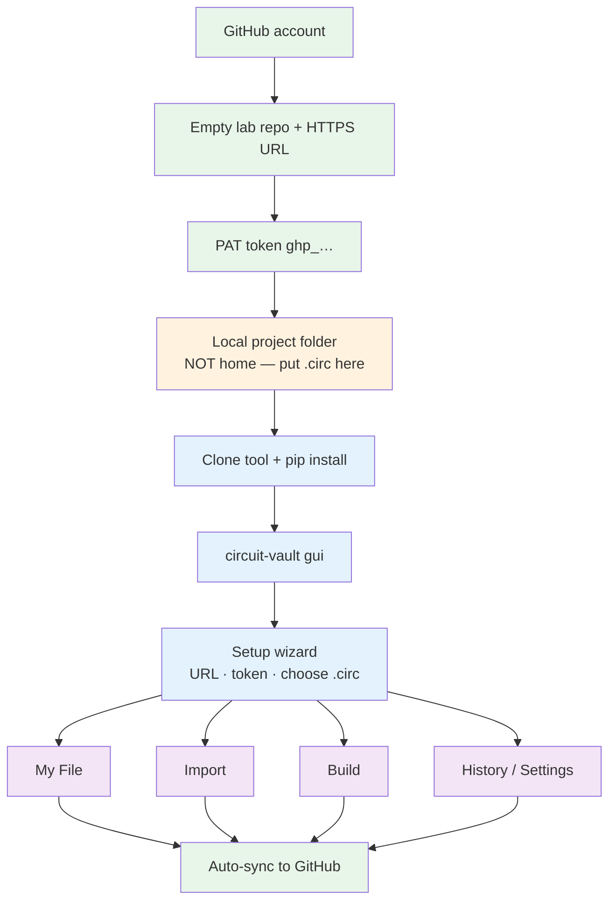

# Circuit Vault

**Tool repo:** [https://github.com/couder-04/circuit-vault](https://github.com/couder-04/circuit-vault)

Protect **Logisim** and **Logisim Evolution** `.circ` files on **Windows**, **macOS**, and **Linux**. Per-circuit finals, surgical restore, shared-file import, Claude-assisted build, and automatic GitHub backup — all from the GUI.

| | Supported |
|--|-----------|
| OS | Windows 10/11 · macOS · Linux |
| Apps | Classic **Logisim** (`source="2.x"`) · **Logisim Evolution** (`source="3.x"`) |

Format is detected from the open `.circ`. Errors show **how to fix** and **how to restart** instead of crashing the app.

---



| Once (green) | Once per machine (blue / orange) | Daily (purple) |
|--------------|----------------------------------|----------------|
| Account → empty repo → PAT | Project folder → install tool → GUI wizard | Mark / Restore / Import / Build |

---

## 1. GitHub account

[https://github.com/signup](https://github.com/signup) — skip if you already have one.

## 2. Empty lab repository

1. GitHub → **+** → **New repository**
2. Name it (e.g. `logisim-lab`) · Public or Private
3. Leave README / .gitignore / license **unchecked** (empty is easiest)
4. **Create repository** → copy the HTTPS URL:

   `https://github.com/YOUR_USERNAME/logisim-lab.git`

This is the **lab** backup repo (your `.circ` + finals). Separate from the Circuit Vault **tool** repo you clone later.

## 3. Personal Access Token (PAT)

GitHub → profile → **Settings** → **Developer settings** → **Personal access tokens** → **Tokens (classic)**  
→ [https://github.com/settings/tokens](https://github.com/settings/tokens)

1. **Generate new token (classic)** · note e.g. `circuit-vault` · pick an expiration
2. Scope: check **`repo`**
3. Generate → copy `ghp_…` **immediately** (shown once)

Fine-grained also works with **Contents: Read and write** on that one lab repo.  
Token is stored in the OS credential store (Keychain / Credential Manager / Secret Service) — never commit it.

## 4. Local project folder (required)

Circuit Vault treats the **folder containing your `.circ`** as the Git project. Do **not** put the `.circ` directly in your home directory (`~` / `%USERPROFILE%`).

**First time — create a dedicated folder and place the file:**

```bash
# macOS / Linux
mkdir -p ~/Documents/logisim-lab
# move/copy your .circ into that folder, e.g. main.circ
```

```powershell
# Windows
mkdir $HOME\Documents\logisim-lab
# move/copy your .circ into that folder
```

**Already synced from another machine — clone the lab repo instead:**

```bash
cd ~/Documents
git clone https://github.com/YOUR_USERNAME/logisim-lab.git
cd logisim-lab
# expect: *.circ  and usually circuit-vault/
```

Expected layout after setup:

```text
logisim-lab/                 ← this folder is what GitHub backs up
  main.circ                   ← live Logisim / Evolution file
  circuit-vault/             ← per-circuit finals (*.xml)
  *.circ.bak-…               ← backups from restore / merge
  .git/                      ← created/used by Circuit Vault
```

Classic and Evolution both use `.circ`; Circuit Vault detects which.

## 5. Prerequisites on this computer

Python **3.11+** and **Git** on PATH:

```bash
python3 --version    # Windows: py -3.11 --version
git --version
```

| OS | If missing |
|----|------------|
| macOS | `brew install python@3.11 git` |
| Windows | [python.org](https://www.python.org/downloads/) + [Git for Windows](https://git-scm.com/download/win) |
| Linux | `sudo apt install python3 python3-pip python3-venv git` |

## 6. Install the Circuit Vault tool

Clone the **tool** repo (not the lab repo), then install editable:

```bash
# macOS / Linux
cd ~/code_playground          # any folder you like
git clone https://github.com/couder-04/circuit-vault.git
cd circuit-vault
python3 -m pip install -e ".[dev]"
```

```powershell
# Windows
cd $HOME\code_playground
git clone https://github.com/couder-04/circuit-vault.git
cd circuit-vault
py -3.11 -m pip install -e ".[dev]"
```

Or copy the whole tool folder via USB/cloud, `cd` into it, then the same `pip install -e ".[dev]"`.

Check:

```bash
circuit-vault --help
```

If `command not found`: `python3 -m circuit_vault.cli --help` (Windows: `py -3.11 -m circuit_vault.cli --help`).

## 7. Start the GUI

```bash
circuit-vault gui
```

Quit by closing the window (macOS: **Cmd+Q**). Start again anytime with the same command.

## 8. Setup wizard (once per computer)

On first launch, **Link GitHub**:

| Field | Value |
|-------|--------|
| GitHub repo URL | Lab HTTPS URL from step 2 |
| Name / Email | Optional — used on commits |
| Access token | PAT from step 3 |
| Choose .circ… | File **inside** the project folder from step 4 |

**OK** runs a test push. Status bar → **☁ Synced** when it works.

Cancel to use offline; link later under **Settings**. On a new machine, install again and re-enter URL + token (credentials do not travel with the repo).

---

## GUI features

Sidebar: **My File** · **Import** · **Build** · **History** · **Settings**  
Status bar: sync state · **Retry sync** when a push fails · active `.circ` name.

### Health dots (My File)

| Dot | Meaning | Action |
|-----|---------|--------|
| Grey | No final yet | **Mark Final** when correct |
| Green | Matches final | — |
| Yellow | Changed since final | **Mark Final** or **Restore** |
| Red | Broken | **Restore** |

Dots refresh every few seconds. Title shows classic vs Evolution for the open file.

### My File

- **Open .circ** / switch files
- **Mark Final** — save that circuit as the canonical XML under `circuit-vault/`
- **Restore** — splice only that circuit back; others untouched; writes a `.bak`
- Auto-sync commits/pushes after mark/restore when linked

### Import

- **Browse shared .circ** → checklist of circuits (grey = unfixable)
- **Merge into** target · clash: `replace` / `keep_both` / `skip`
- **Fix & Merge Selected** — auto-repair when possible; confirms dependency pulls
- Cross-format (classic ↔ Evolution) allowed with a warning — verify in the Logisim app you use

### Build

- **Target Logisim**: Auto / Evolution / classic (shapes the Claude prompt)
- Description · component checklist · custom names · inputs / outputs
- **Generate Prompt** → **Copy** / **Open Claude**
- Paste `<circuit>…</circuit>` or **Attach .xml** → validate → **Build & Merge**
- Open the result in Logisim / Evolution and check wiring

### History

- Recent local/git actions
- **Undo last action** — restores from the latest backup when available

### Settings

- Repo URL · name · email · new token → **Save & test push**
- **Auto-sync** (default on)
- **Push backups (.bak)** (repo grows over time if on)
- **Change active .circ**

---

## Two computers

1. Machine A: work until **☁ Synced**
2. Machine B: `cd` into the lab folder → `git pull` → `circuit-vault gui` → open the same `.circ`
3. Before switching again: wait for sync, then `git pull` on the other side

Do not edit the same circuit on both machines offline without pulling — git conflicts.

---

## Config locations

| OS | Session config |
|----|----------------|
| Windows | `%APPDATA%\circuit-vault\config.json` |
| macOS / Linux | `~/.config/circuit-vault/config.json` |

Token: OS credential store only.

---

## If something fails

Dialogs and setup errors include **How to fix** and **How to restart** (`circuit-vault gui`). Common cases:

- `.circ` in home → move into a dedicated project folder, reopen
- Token expired → new PAT → **Settings** → paste → **Save & test push**
- Push failed → check URL/token · **Retry sync**

Longer practice / troubleshooting → **[USER_MANUAL.md](USER_MANUAL.md)**.
