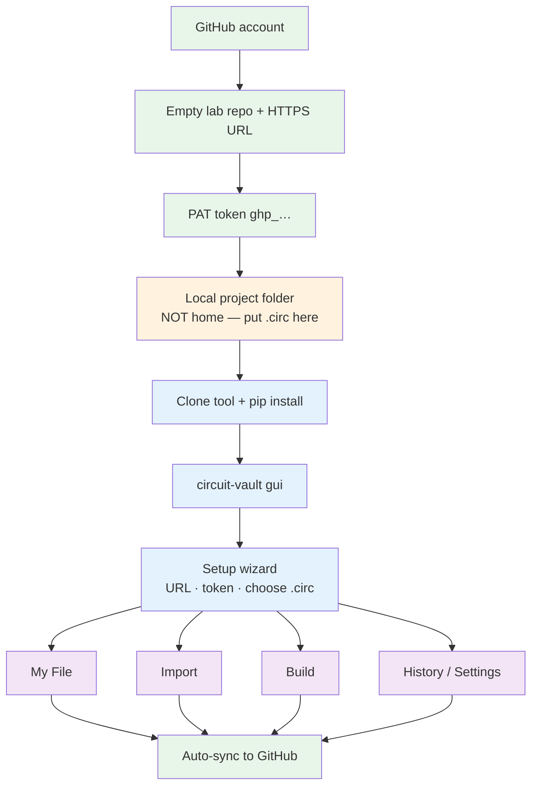

# Circuit Vault

**Tool repo:** [https://github.com/couder-04/circuit-vault](https://github.com/couder-04/circuit-vault)

Protect **Logisim** and **Logisim Evolution** `.circ` files on **Windows**, **macOS**, and **Linux**. Per-circuit finals, surgical restore, shared-file import, Claude-assisted build, and automatic GitHub backup — all from the GUI.

| | Supported |
|--|-----------|
| OS | Windows 10/11 · macOS · Linux |
| Apps | Classic **Logisim** (`source="2.x"`) · **Logisim Evolution** (`source="3.x"`) |

Format is detected from the open `.circ`. Errors show **how to fix** and **how to restart** instead of crashing the app.

---



| Once (green) | Once per machine (blue / orange) | Daily (purple) |
|--------------|----------------------------------|----------------|
| Account → empty repo → PAT | Project folder → install tool → GUI wizard | Mark / Restore / Import / Build |

---

## 1. GitHub account

[https://github.com/signup](https://github.com/signup) — skip if you already have one.

## 2. Empty lab repository

**Option A — browser**

1. GitHub → **+** → **New repository**
2. Name it (e.g. `tracked_logism_lab`) · Public or Private
3. Leave README / .gitignore / license **unchecked** (empty is easiest)
4. **Create repository** → copy the HTTPS URL:

   `https://github.com/YOUR_USERNAME/tracked_logism_lab.git`

**Option B — GitHub CLI** (after you finish [§5a](#5a-install-and-log-in-with-github-cli-gh) below):

```bash
gh repo create tracked_logism_lab --private
# prints the repo URL — copy it for the Circuit Vault setup wizard
# later: gh repo clone YOUR_USERNAME/tracked_logism_lab
```

Add `--public` instead of `--private` if you prefer a public lab repo.

This is the **lab** backup repo (your `.circ` + finals). Separate from the Circuit Vault **tool** repo ([couder-04/circuit-vault](https://github.com/couder-04/circuit-vault)) you clone later.

**Sync always targets your lab repo.** Never paste the tool URL (`couder-04/circuit-vault`) into the setup wizard — that causes *Write access to repository not granted*.

## 3. Personal access token (PAT)

Circuit Vault’s GUI needs a PAT for auto-sync (stored in Keychain / Credential Manager).  
**Without Write access on your lab repo, push fails** (`Write access to repository not granted`).

### Recommended — fine-grained token (pick the repo + Read and Write)

1. Open [https://github.com/settings/personal-access-tokens/new](https://github.com/settings/personal-access-tokens/new)  
   (GitHub → profile → **Settings** → **Developer settings** → **Personal access tokens** → **Fine-grained tokens** → **Generate new token**)
2. **Token name**: e.g. `circuit-vault`
3. **Expiration**: pick a date you are comfortable with
4. **Resource owner**: your GitHub user
5. **Repository access** — choose **Only select repositories** → **select your lab repo**  
   (e.g. `tracked_logism_lab` — the one from §2, **not** `couder-04/circuit-vault`)
6. **Permissions** → **Repository permissions** → **Contents** → set to **Read and write**  
   (both Read **and** Write — this is required for Circuit Vault to push finals / backups)
7. Leave other permissions as default unless you know you need more
8. **Generate token** → copy `github_pat_…` **immediately** (shown once)

> **Important:** If you skip selecting the lab repo, or leave Contents as **Read-only**, sync will fail. Always: **select that repo** + **Contents = Read and write**.

### Alternative — classic token

GitHub → **Settings** → **Developer settings** → **Personal access tokens** → **Tokens (classic)**  
→ [https://github.com/settings/tokens](https://github.com/settings/tokens)

1. **Generate new token (classic)** · note e.g. `circuit-vault` · pick an expiration
2. Scope: check **`repo`** (includes read + write for all your repos)
3. Generate → copy `ghp_…` **immediately** (shown once)

Token is stored in the OS credential store — never commit it. Paste it into the Circuit Vault setup wizard / Settings.

## 4. Local project folder (required)

Circuit Vault treats the **folder containing your `.circ`** as the Git project. Do **not** put the `.circ` directly in your home directory (`~` / `%USERPROFILE%`).

Recommended layout on the **Desktop**:

```text
Desktop/
  tracked_logism_lab/              ← outer folder (organizer)
    lab/                           ← Git project GitHub backs up (.circ lives here)
    circuit-vault/                 ← tool clone (install from here)
```

**First time — create folders and place the file:**

```bash
# macOS / Linux
mkdir -p ~/Desktop/tracked_logism_lab/lab
# move/copy your .circ into lab/, e.g. main.circ
```

```powershell
# Windows
mkdir $HOME\Desktop\tracked_logism_lab\lab
# move/copy your .circ into lab\
```

**Already synced from another machine — clone the lab repo into `lab`:**

```bash
mkdir -p ~/Desktop/tracked_logism_lab
cd ~/Desktop/tracked_logism_lab
gh repo clone YOUR_USERNAME/tracked_logism_lab lab
# same as: git clone https://github.com/YOUR_USERNAME/tracked_logism_lab.git lab
cd lab
# expect: *.circ  and usually circuit-vault/ (finals folder)
```

Expected layout inside `lab/` after setup:

```text
Desktop/tracked_logism_lab/
  lab/                       ← this folder is what GitHub backs up
    main.circ                 ← live Logisim / Evolution file
    circuit-vault/           ← per-circuit finals (*.xml)
    *.circ.bak-…             ← backups from restore / merge
    .git/                    ← created/used by Circuit Vault
  circuit-vault/             ← the Circuit Vault tool (separate)
```

Classic and Evolution both use `.circ`; Circuit Vault detects which.

## 5. Prerequisites on this computer

Python **3.11+**, **Git**, and (recommended) **GitHub CLI (`gh`)** on PATH:

```bash
python3 --version    # Windows: py -3.11 --version
git --version
gh --version         # optional but recommended
```

| OS | If missing |
|----|------------|
| macOS | `brew install python@3.11 git gh` |
| Windows | [python.org](https://www.python.org/downloads/) + [Git for Windows](https://git-scm.com/download/win) + `winget install GitHub.cli` |
| Linux | `sudo apt install python3 python3-pip python3-venv git` then [install `gh`](https://github.com/cli/cli#installation) |

### 5a. Install and log in with GitHub CLI (`gh`)

Do this once per computer. It makes clone / create / pull much easier.

```bash
# Install (pick your OS)
brew install gh                          # macOS
winget install GitHub.cli                # Windows
# Linux: see https://github.com/cli/cli#installation

# Log in (browser is easiest for newbies)
gh auth login
```

When prompted, typical newbie choices:

1. **GitHub.com**
2. **HTTPS**
3. Authenticate Git with GitHub credentials? **Yes**
4. Login method: **Login with a web browser**
5. Copy the one-time code → press Enter → paste/approve in the browser

Check:

```bash
gh auth status
```

Useful follow-ups:

```bash
gh auth refresh -s repo    # if a command asks for more permissions
gh repo list               # see your repos
```

## 6. Install the Circuit Vault tool

Clone the **tool** repo (not the lab repo), then install editable.

**Recommended (`gh`):**

```bash
# macOS / Linux
mkdir -p ~/Desktop/tracked_logism_lab
cd ~/Desktop/tracked_logism_lab
gh repo clone couder-04/circuit-vault
cd circuit-vault
python3 -m pip install -e ".[dev]"
```

```powershell
# Windows
mkdir $HOME\Desktop\tracked_logism_lab
cd $HOME\Desktop\tracked_logism_lab
gh repo clone couder-04/circuit-vault
cd circuit-vault
py -3.11 -m pip install -e ".[dev]"
```

**Same thing with plain `git`:**

```bash
mkdir -p ~/Desktop/tracked_logism_lab
cd ~/Desktop/tracked_logism_lab
git clone https://github.com/couder-04/circuit-vault.git
cd circuit-vault
python3 -m pip install -e ".[dev]"
```

Or copy the whole tool folder via USB/cloud, `cd` into it, then the same `pip install -e ".[dev]"`.

Check:

```bash
circuit-vault --help
```

If `command not found`: `python3 -m circuit_vault.cli --help` (Windows: `py -3.11 -m circuit_vault.cli --help`).

### Quick command block (tool + lab with `gh`)

```bash
# once per Mac/PC
brew install gh            # or winget install GitHub.cli
gh auth login

# Desktop → tracked_logism_lab → (tool + lab)
mkdir -p ~/Desktop/tracked_logism_lab/lab
cd ~/Desktop/tracked_logism_lab

# install the tool
gh repo clone couder-04/circuit-vault
cd circuit-vault
python3 -m pip install -e ".[dev]"

# your .circ go in lab/ (first machine: copy files in; other machine: clone)
# gh repo clone YOUR_USERNAME/tracked_logism_lab lab
# or: copy main.circ into ~/Desktop/tracked_logism_lab/lab/

circuit-vault gui
# wizard: choose a .circ inside Desktop/tracked_logism_lab/lab/
```
## 7. Start the GUI

```bash
circuit-vault gui
```

Quit by closing the window (macOS: **Cmd+Q**). Start again anytime with the same command.

## 8. Setup wizard (once per computer)

On first launch, **Link GitHub**:

| Field | Value |
|-------|--------|
| GitHub repo URL | **Your** lab HTTPS URL from step 2 (`…/YOUR_USERNAME/tracked_logism_lab.git`) — not the tool repo |
| Name / Email | Optional — used on commits |
| Access token | PAT from step 3 (must have write access to **that** lab repo) |
| Choose .circ… | File **inside** `Desktop/tracked_logism_lab/lab/` |

**OK** runs a test push. Status bar → **☁ Synced** when it works.

Cancel to use offline; link later under **Settings**. On a new machine, install again and re-enter URL + token (credentials do not travel with the repo).

---

## GUI features

Sidebar: **My File** · **Import** · **Build** · **History** · **Settings**  
Status bar: sync state · **Retry sync** when a push fails · active `.circ` name.

### Health dots (My File)

| Dot | Meaning | Action |
|-----|---------|--------|
| Grey | No final yet | **Mark Final** when correct |
| Green | Matches final | — |
| Yellow | Changed since final | **Mark Final** or **Restore** |
| Red | Broken | **Restore** |

Dots refresh every few seconds. Title shows classic vs Evolution for the open file.

### My File

- **Open .circ** / switch files
- **Mark Final** — save that circuit as the canonical XML under `circuit-vault/`
- **Restore** — splice only that circuit back; others untouched; writes a `.bak`
- Auto-sync commits/pushes after mark/restore when linked

### Import

- **Browse shared .circ** → checklist of circuits (grey = unfixable)
- **Merge into** target · clash: `replace` / `keep_both` / `skip`
- **Fix & Merge Selected** — auto-repair when possible; confirms dependency pulls
- Cross-format (classic ↔ Evolution) allowed with a warning — verify in the Logisim app you use

### Build

- **Target Logisim**: Auto / Evolution / classic (shapes the Claude prompt)
- Description · **circuit name** · component checklist · inputs / outputs
- **Your circuits from this .circ** — add the **exact** My File name, then fill a **brief description** on that row (pins / what it does) so Claude builds better XML. Remove if needed. Names that are not in the file are rejected.
- **Generate Prompt** → **Copy** / **Open Claude**
- Paste `<circuit>…</circuit>` or **Attach .xml** → validate → **Build & Merge**
- If the circuit name already exists, a number is added (`Adder` → `Adder1`); success shows e.g. **Component Adder is ready!**
- Missing subcircuit (e.g. needs `Full Adder` but it is not in the file) → app does **not** crash; it offers a **Copy fix prompt** for Claude to rewrite the XML (gates or only existing circuit names), then paste again and merge
- Open the result in Logisim / Evolution and check wiring

### History

- Recent local/git actions
- **Undo last action** — restores from the latest backup when available

### Settings

- Repo URL · name · email · new token → **Save & test push**
- **Auto-sync** (default on)
- **Push backups (.bak)** (repo grows over time if on)
- **Change active .circ**

---

## Two computers

1. Machine A: work until **☁ Synced**
2. Machine B:

```bash
mkdir -p ~/Desktop/tracked_logism_lab
cd ~/Desktop/tracked_logism_lab
gh repo clone YOUR_USERNAME/tracked_logism_lab lab   # first time only
cd lab
git pull                                  # later visits
circuit-vault gui
```

3. Before switching again: wait for sync, then `git pull` (or `gh repo sync`) on the other side

Do not edit the same circuit on both machines offline without pulling — git conflicts.

---

## Config locations

| OS | Session config |
|----|----------------|
| Windows | `%APPDATA%\circuit-vault\config.json` |
| macOS / Linux | `~/.config/circuit-vault/config.json` |

Token: OS credential store only.

---

## If something fails

Dialogs and setup errors include **How to fix** and **How to restart** (`circuit-vault gui`). Common cases:

- `.circ` in home → move into a dedicated project folder, reopen
- Token expired → new PAT → **Settings** → paste → **Save & test push**
- Push failed → check URL/token · **Retry sync**

### Sync failed — *Write access to repository not granted*

GitHub rejected the push. Almost always one of these:

1. **Wrong URL in Settings** — you linked the **tool** repo (`couder-04/circuit-vault`) instead of **your lab** repo  
2. **Token can’t write** — missing `repo` scope, expired, or for a different account  
3. **Someone else’s lab** — you cloned a friend’s repo and aren’t a collaborator

**Fix (recommended) — use your own lab:**

```bash
# 1) Log in as YOU (once per computer)
gh auth login
# GitHub.com → HTTPS → Yes → Login with a web browser
gh auth status    # must show YOUR username

# 2) Create (or reuse) YOUR lab repo — not couder-04/circuit-vault
gh repo create tracked_logism_lab --private
# copy the printed URL, e.g. https://github.com/YOUR_USERNAME/tracked_logism_lab.git

# 3) Put your .circ in lab/, then open the GUI
mkdir -p ~/Desktop/tracked_logism_lab/lab
# copy/move your .circ into ~/Desktop/tracked_logism_lab/lab/
circuit-vault gui
```

In the wizard / **Settings**:

| Field | Must be |
|-------|---------|
| GitHub repo URL | `https://github.com/YOUR_USERNAME/tracked_logism_lab.git` |
| Access token | Fine-grained: **Only select repositories** → your lab repo → **Contents = Read and write**; or classic PAT with **`repo`** checked |
| Choose .circ… | A file inside `Desktop/tracked_logism_lab/lab/` |

Then **Save & test push**.

If the token was fine-grained but **Contents** was only **Read-only**, or you never selected the lab repo under **Repository access**, create a new token with both fixed (see §3) and paste it in Settings.

**Optional — share one lab with a friend** (both can sync to the same repo):

```bash
# repo owner runs once (replace FRIEND_USERNAME)
gh api -X PUT repos/YOUR_USERNAME/tracked_logism_lab/collaborators/FRIEND_USERNAME -f permission=push
```

Friend accepts the invite on GitHub, then uses that same lab URL + **their own** PAT (with access to that repo).

**Check what the GUI is linked to** (from your `.circ` folder):

```bash
cd ~/Desktop/tracked_logism_lab/lab    # folder that contains your .circ
git remote -v                          # origin must be YOUR lab, not couder-04/circuit-vault
```

If `origin` is wrong:

```bash
git remote set-url origin https://github.com/YOUR_USERNAME/tracked_logism_lab.git
# then Settings → paste the same URL + PAT → Save & test push
```

Longer practice / troubleshooting → **[USER_MANUAL.md](USER_MANUAL.md)**.
